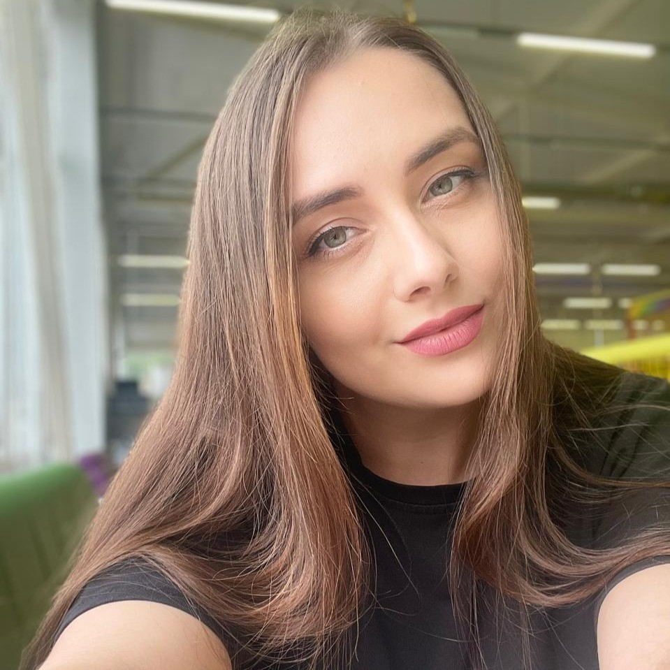

## Здравствуй! Я начинающий Java-разработчик.

Меня зовут ***Елизавета***, мне 32 года, есть высшее техническое образование, а так же: музыкальное, художественное и театральное. Работаю ведущим инженером-энергетиком.
Сейчас интересуюсь java/Android разработкой

Я изучила:
1. Основы ООП
2. Git
3. GitHub
   
> "Каждый должен научиться программировать на компьютере, потому что это учит думать" — Стив Джобс.   
   
### Обратная связь
- Email: nikolaevaelizaveta409@gmail.com
- Telegram: https://t.me/Lizzel_S